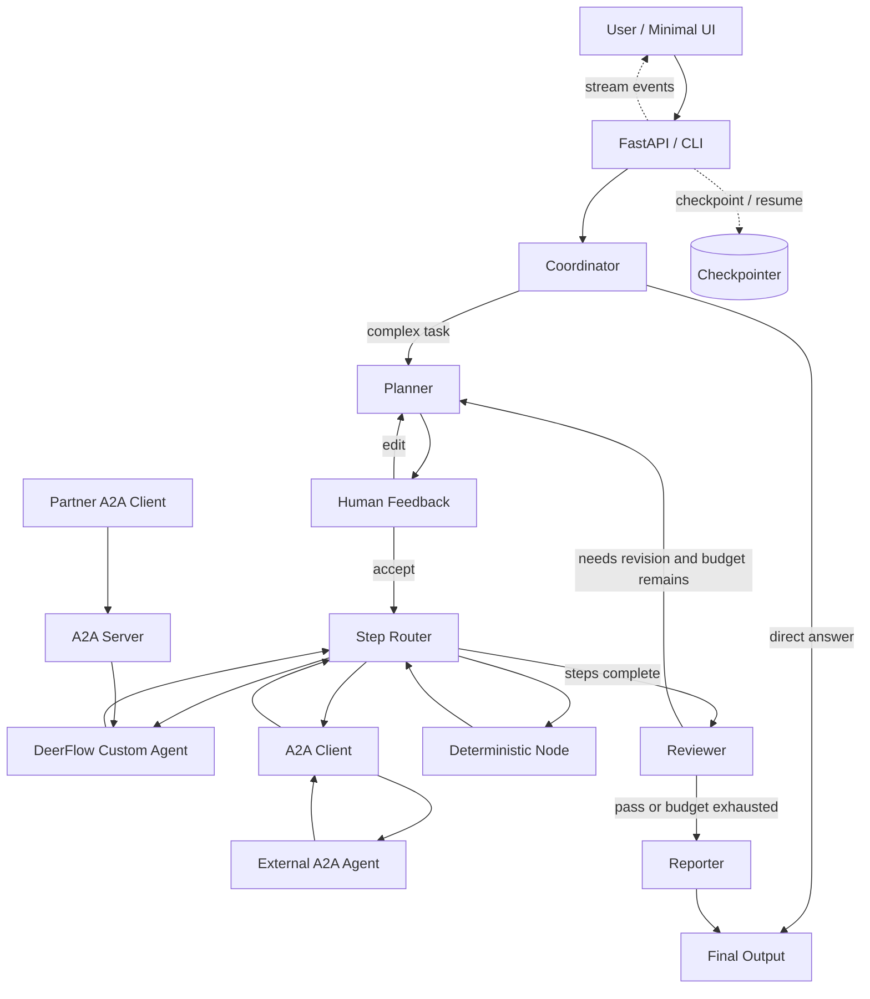

# 自定义 Agent 与 LangGraph 工作流 12 周学习计划

> 学习周期：12 周（84 天）
>
> 学习投入：每天约 2 小时，总计约 168 小时
>
> 主线技术：Python、LangChain 基础原语、LangGraph、DeerFlow
>
> 源码样本：[bytedance/deer-flow](https://github.com/bytedance/deer-flow)
>
> 最终作品：一个基于 DeerFlow 的自定义 Agent、一条 LangGraph 工作流，以及一层可集成外部 Agent 的 A2A 接口

---

## 1. 学习目标

12 周后，不以“运行过 DeerFlow”或“会调用框架 API”为完成标准，而要能从空目录完成下面两件事。

### 1.1 自定义 Agent

基于 DeerFlow 2.0 Harness 组装一个面向具体任务的 Agent。它能够：

- 使用自定义 system prompt、结构化输出和不少于 3 个工具；
- 自主判断何时调用工具、读取工具结果、继续推理或停止；
- 处理工具异常、超时、最大步数和无效参数；
- 输出可追踪的消息与工具调用记录；
- 通过 Skill、Middleware 或 Subagent 扩展领域能力；
- 通过 A2A 发现并调用外部 Agent，也能把自身能力暴露给其他 Agent；
- 用测试和评测集证明它在目标任务上有效。

### 1.2 自定义 Agent 工作流

使用 LangGraph 实现一条多阶段工作流。它至少包含：

- 显式 State、Node、Edge、条件路由和有限循环；
- coordinator、planner、executor、reviewer、reporter 等职责明确的节点；
- 计划的结构化输出与人工确认；
- checkpoint、暂停/恢复、流式事件和失败重试；
- 至少一个由自定义 Agent 执行的节点；
- 至少一个通过 A2A 调用外部 Agent 的节点；
- 节点测试、路由测试、端到端测试和可重复评测。

### 1.3 最终项目

最终项目包含两个可独立验证、可以组合运行的部分：

- **自定义 Agent**：基于 DeerFlow Harness 配置模型、Prompt、工具、Skill、Middleware 和 Subagent；
- **A2A 接入层**：把自定义 Agent 暴露为 A2A Server，并作为 A2A Client 集成至少一个外部 Agent；
- **自定义工作流**：使用 LangGraph 编排澄清、规划、人工确认、本地/外部 Agent 执行、质量检查和报告生成。

可以替换成其他业务主题，但工作流复杂度和验收标准不能降低。

```text
用户输入
  → coordinator 判断是否需要进入工作流
  → planner 生成结构化计划
  → human_feedback 接受或修改计划
  → executor 按步骤调用 DeerFlow 自定义 Agent、外部 A2A Agent 或确定性节点
  → reviewer 检查证据与完成度
  → 未通过时有限次数返工
  → reporter 生成最终结果
```

---

## 2. 技术路线与边界

这三层是递进关系，不是三个互斥框架。

| 层级 | 本计划中的作用 | 必须掌握的内容 |
|---|---|---|
| LangChain 原语 | 模型、消息、Prompt、结构化输出、Tool | 为 Agent 和节点提供基础能力 |
| LangGraph | 状态与流程编排 | State、Reducer、Node、Edge、Command、Send、Stream、Checkpoint、Interrupt |
| DeerFlow 2.0 | 自定义 Agent Harness | Lead Agent、Middleware、Skills、Subagents、Memory、Sandbox、Context Engineering |
| A2A | 跨系统 Agent 协作 | Agent Card、Message、Task、Artifact、Streaming、Cancel、Auth、版本兼容 |

框架选择原则：

- 单次模型调用或固定链路：直接使用模型与结构化输出；
- 单一目标、标准工具循环：使用 LangChain Agent 或手写 Agent Loop；
- 有分支、循环、并行、持久化或人工介入：使用 LangGraph；
- 需要发现、调用或向外提供独立 Agent 服务：使用 A2A；
- DeerFlow 用于阅读、验证和提炼设计，不作为最终项目的复制模板。

### 2.1 版本注意事项

`bytedance/deer-flow` 的 `main` 分支是 DeerFlow 2.0，是一次不复用 1.x 代码的重写。它不是固定的 coordinator/planner/reporter 研究图，而是基于 LangChain Agent 与 LangGraph Runtime 的 Super Agent Harness。

开始源码学习时记录仓库 commit、DeerFlow 版本和依赖锁文件，并维护 `notes/version-differences.md`。主线以 `main` 的 2.0 架构为准；只有研究历史演进时才阅读 `main-1.x`。

A2A 协议和 SDK 也在持续演进。第 9 周开始时固定 specification 与 `a2a-sdk` 版本，优先使用当前 1.x API，不把旧教程中的 0.2/0.3 数据结构直接复制到项目中。

### 2.2 本期非主线

以下内容只作为选修扩展，不占用主线时间：

- 复杂前端编辑器、代码生成和沙箱预览；
- 多模态生成和多模型路由；
- 大规模 RAG 平台和生产部署；
- 复制 DeerFlow 全部 UI 或所有工具。

---

## 3. 学习方法与交付规则

### 3.1 每天 2 小时模板

- 10 分钟：闭卷回答前一次学习的 3 个问题；
- 25 分钟：阅读官方文档或指定源码；
- 65 分钟：编码、调试和测试；
- 15 分钟：用自己的话解释今天的知识；
- 5 分钟：记录证据、问题和下一步。

如果当天只有 1 小时，优先完成“闭卷回忆 + 最小可运行代码 + 测试”，阅读顺延。

### 3.2 间隔复习

- D0：完成实现和费曼解释；
- D1：闭卷回答；
- D3：改变输入或失败条件后重做；
- D7：在周项目中应用；
- D14：与后续知识混合练习；
- D30：从空目录重建最小版本。

### 3.3 每日产物

每天至少留下一个可检查产物：代码、测试、执行轨迹、架构图、源码笔记、评测结果或 ADR。仅“看完文档”不算完成。

每日评分保存到 `assessments/WxDy.md`。

| 维度 | 分值 | 证据 |
|---|---:|---|
| 任务完成度 | 25 | 必做项和当日产物是否齐全 |
| 概念正确性 | 25 | 能否准确解释并区分相近概念 |
| 动手实现 | 25 | 能否运行、修改和调试，而非复制 |
| 闭卷检索 | 15 | 不看资料能否回答核心问题 |
| 复盘与迁移 | 10 | 能否说明失败原因和新场景用法 |

- 90～100：掌握，按计划前进；
- 80～89：基本掌握，下一课增加一道补强题；
- 70～79：部分掌握，先补练 15～30 分钟；
- 低于 70：暂停新增内容，重做核心实验。

---

## 4. 建议目录

```text
agent-learning/
├── notes/                    # 费曼笔记、源码地图、版本差异
├── assessments/              # 每日与每周评分
├── labs/                     # 每日最小实验
├── evaluations/              # 数据集、轨迹和评测结果
├── custom-agent/             # 第 2 周起的自定义 Agent
├── custom-workflow/          # 第 3 周起的 LangGraph 工作流
├── deer-flow-study/          # DeerFlow 源码笔记与实验补丁
├── a2a-integration/          # A2A client/server、契约和兼容性测试
└── capstone/                 # 最终项目
```

推荐 Python 3.12、`uv`、Git 和可替换的模型供应商。密钥只放在 `.env`，仓库只提交 `.env.example`。

---

# 第 1 周：LLM 与 Python 基础

**周目标**：建立 Agent 开发所需的 Python、消息、Prompt 和结构化输出基础。

**周产物**：命令行“需求澄清助手”。

**说明**：已有 Day 1～Day 6 产物时不重做，只修正未通过的评分项。

## Day 1：环境与基线

- **学习**：配置 Python、`uv`、`.env`；调用一次模型并记录耗时与 Token。
- **产物**：`baseline.md`，解释 temperature、上下文窗口、输入/输出 Token。

## Day 2：Python 类型与异步

- **学习**：类型注解、Pydantic、异常、`async/await` 和并发限制。
- **产物**：异步批量调用模拟器及超时测试。

## Day 3：消息与上下文

- **学习**：system/user/assistant/tool 消息和上下文裁剪。
- **产物**：打印完整请求与响应，实现最小消息历史裁剪。

## Day 4：Prompt 作为接口契约

- **学习**：角色、约束、示例、输出契约和验收标准。
- **产物**：两版 Prompt、10 条输入和对比记录。

## Day 5：结构化输出

- **学习**：Pydantic schema、解析、校验和失败处理。
- **产物**：结构化需求模型与至少 3 个失败测试。

## Day 6：最小 CLI

- **学习**：把模型、配置、日志和错误处理封装成程序。
- **产物**：可运行的需求澄清 CLI 和 3 个失败案例。

## Day 7：周复习

- **任务**：完成 README、测试和执行示例；闭卷画出输入到结构化输出的全链路。
- **验收**：陌生输入可运行；异常有明确提示；代码中没有密钥。

---

# 第 2 周：从零实现自定义 Agent

**周目标**：理解 Agent 的本质，先手写循环，再使用框架实现同一能力。

**周产物**：带 3 个工具、预算与轨迹的自定义 Agent v0.1。

## Day 8：工具契约

- **学习**：工具名称、描述、参数 schema、返回值和错误语义。
- **产物**：`search_notes`、`read_file`、`calculate` 三个只读工具及单测。

## Day 9：手写 Agent Loop

- **学习**：模型请求、tool call 检测、工具执行、ToolMessage 回填和停止条件。
- **产物**：不依赖 Agent 框架的最小循环及时序图。

## Day 10：安全与边界

- **学习**：参数校验、路径约束、超时、最大轮数和结果大小限制。
- **产物**：路径穿越、无效参数、超时和无限循环测试。

## Day 11：错误恢复

- **学习**：区分瞬时错误、模型可修复错误、用户可修复错误和程序错误。
- **产物**：让 Agent 根据工具错误修正一次调用，并证明不会无限重试。

## Day 12：框架版 Agent

- **学习**：用 LangChain Agent 或 LangGraph `ToolNode` 重建同等能力。
- **产物**：手写版与框架版在消息、控制权、异常和代码量上的对比表。

## Day 13：可观察性

- **学习**：run_id、step、工具参数摘要、耗时、状态和错误。
- **产物**：JSONL 轨迹和敏感字段脱敏测试。

## Day 14：周项目

- **任务**：完成“项目资料分析 Agent v0.1”。
- **验收**：能选择并调用 3 个工具；最大步数有效；每次运行有完整轨迹；至少 10 条评测输入。

---

# 第 3 周：LangGraph 基础

**周目标**：把 Agent 理解为状态转换系统，掌握自定义工作流的基本构件。

**周产物**：包含分支、循环和并行的 LangGraph 实验集。

## Day 15：StateGraph 心智模型

- **学习**：State、Node、Edge、START、END 和 `compile()`。
- **产物**：`START → analyze → answer → END` 最小图及图示。

## Day 16：状态与 Reducer

- **学习**：覆盖式字段、追加式字段、`MessagesState` 和 partial update。
- **产物**：证明“缺少 reducer 会丢数据”的失败测试。

## Day 17：条件路由

- **学习**：`add_conditional_edges` 与路由函数。
- **产物**：简单问题直答、复杂问题规划、非法输入拒绝三条路径。

## Day 18：Command

- **学习**：在节点中同时更新 State 和决定 `goto`。
- **产物**：使用 `Command` 重写 Day 17，并测试所有目的节点。

## Day 19：循环与终止

- **学习**：反思/修复循环、最大次数、重复错误检测和 recursion limit。
- **产物**：一个可成功退出和一个强制终止的测试。

## Day 20：Send 与并行

- **学习**：动态 fan-out/fan-in、worker 输入和结果 reducer。
- **产物**：并行处理 3 个子任务并汇总，比较串行与并行耗时。

## Day 21：周项目

- **任务**：实现“分析 → 多路处理 → 汇总 → 检查 → 有限返工”的纯工作流。
- **验收**：节点只返回 partial update；列表字段有 reducer；每条边和终止条件均有测试。

---

# 第 4 周：自定义 Agent 工作流 v0.1

**周目标**：把自定义 Agent 放进 LangGraph，形成职责清晰的多阶段工作流。

**周产物**：coordinator、planner、executor、reviewer、reporter 工作流。

## Day 22：先画图再编码

- **学习**：把业务步骤分类为 LLM、数据、动作和用户输入节点。
- **产物**：流程图，以及每个节点的输入、输出、失败与重试表。

## Day 23：工作流 State

- **学习**：区分原始数据、派生数据、运行控制和最终产物。
- **产物**：`WorkflowState` 及字段所有权说明。

## Day 24：Coordinator

- **学习**：识别闲聊、信息不足和可执行任务，决定直答或进入规划。
- **产物**：结构化路由结果及三类分支测试。

## Day 25：Planner

- **学习**：用 Pydantic 定义 Plan/Step，限制步骤数量和类型。
- **产物**：计划生成节点、schema 测试和无效计划处理。

## Day 26：Executor

- **学习**：按 Step 类型把任务交给不同自定义 Agent 或普通节点。
- **产物**：至少两个执行角色和统一的执行结果契约。

## Day 27：Reviewer 与 Reporter

- **学习**：将“检查是否完成”和“生成最终答案”分成两个职责。
- **产物**：证据/完整度检查、一次有限返工和最终报告节点。

## Day 28：周项目

- **任务**：完成自定义 Agent 工作流 v0.1。
- **验收**：5 类节点可独立测试；计划为结构化数据；至少一条返工路径；从输入到报告可端到端运行。

---

# 第 5 周：持久化、人工介入与流式执行

**周目标**：让工作流能够暂停、恢复、接受计划修改，并把执行过程持续输出。

**周产物**：自定义 Agent 工作流 v0.2。

## Day 29：Checkpoint 与 Thread

- **学习**：run、thread、checkpoint 和 state snapshot 的关系。
- **产物**：加入 checkpointer，使用两个 `thread_id` 验证状态隔离。

## Day 30：暂停与恢复

- **学习**：`interrupt()` 与 `Command(resume=...)`。
- **产物**：在计划执行前暂停，支持接受、修改和拒绝。

## Day 31：持久化边界

- **学习**：内存 checkpointer 与数据库 checkpointer 的用途差异。
- **产物**：进程重启恢复实验和“哪些状态必须持久化”ADR。

## Day 32：流式模式

- **学习**：`values`、`updates`、`messages` 和 `custom`。
- **产物**：分别输出状态变化、token 和自定义进度事件。

## Day 33：幂等与副作用

- **学习**：恢复执行可能重复调用工具的原因。
- **产物**：idempotency key、去重记录和重复写入测试。

## Day 34：错误策略

- **学习**：RetryPolicy、工具错误回填、用户补充信息和异常上抛。
- **产物**：错误分类决策表与 5 条故障演练。

## Day 35：周项目

- **任务**：升级 v0.2，支持计划审批、断点恢复和事件流。
- **验收**：拒绝与修改路径正确；恢复不重复副作用；流事件可解释当前节点和状态。

---

# 第 6 周：运行并建立 DeerFlow 2.0 源码地图

**周目标**：运行官方主仓库，理解 Gateway、Agent Harness 与前端之间的边界。

**周产物**：《DeerFlow 2.0 源码地图 v1》。

## Day 36：锁定版本并运行

- **学习**：记录 commit、DeerFlow 版本、Python/Node 和锁定依赖，阅读 `README.md` 与 `Install.md`。
- **产物**：可重复启动步骤、一次完整 Agent Run 和踩坑记录。

## Day 37：Monorepo 地图

- **学习**：识别 `backend/app`、`backend/packages/harness`、`frontend`、`skills` 和配置文件的边界。
- **产物**：Container 图与目录职责表，所有判断附入口源码证据。

## Day 38：Lead Agent 组装入口

- **学习**：阅读 `agents/lead_agent/agent.py` 的 `make_lead_agent`、`assemble_lead_agent` 和 `create_agent` 调用。
- **产物**：从配置到 model、tools、middleware、state schema 和 compiled graph 的组装图。

## Day 39：ThreadState 与 Runtime

- **学习**：阅读 `agents/thread_state.py`，理解消息、todos、artifacts、goal、delegations 和 reducer。
- **产物**：ThreadState 字段所有权表，并与第 4 周 `WorkflowState` 对比。

## Day 40：Gateway 与执行链

- **学习**：从 Gateway 的 run/thread API 追踪到 Agent graph、checkpoint 和 stream event。
- **产物**：浏览器输入到模型、工具、SSE 再回到 UI 的调用时序图。

## Day 41：工具与 Sandbox

- **学习**：追踪 built-in/configured/MCP tools，以及 SandboxProvider、虚拟路径和文件工具。
- **产物**：工具来源图、权限边界和一次只读工具执行轨迹。

## Day 42：周复习

- **任务**：闭卷讲解 DeerFlow 2.0 如何把模型、工具、中间件、状态和运行时组装成 Lead Agent。
- **验收**：能从架构图定位到关键源码；能说明 2.0 与 `main-1.x` 至少 5 个差异。

---

# 第 7 周：拆解 DeerFlow Harness 核心机制

**周目标**：理解 DeerFlow 如何通过 Middleware、Skills、Subagents、Memory 和 Context Engineering 扩展 Agent。

**周产物**：《DeerFlow 2.0 Harness 关键机制导读》。

## Day 43：Middleware 执行模型

- **学习**：理解 before/after agent、wrap model、wrap tool 等 hook 以及 middleware 顺序的影响。
- **产物**：一次模型与工具调用经过 middleware chain 的时序图。

## Day 44：Planning 与 Clarification

- **学习**：阅读 Todo、Clarification 和 LoopDetection Middleware，区分 middleware 控制与显式图路由。
- **产物**：与第 4 周 planner/reviewer 节点的对比表。

## Day 45：Skills

- **学习**：追踪 Skill 扫描、激活、上下文注入和工具权限，理解按需加载的意义。
- **产物**：一个最小领域 Skill，以及“何时用 Skill/Prompt/Tool”的决策表。

## Day 46：Subagents

- **学习**：追踪 `task` 工具、SubagentRuntime、类型 allowlist、并发与总量限制。
- **产物**：Lead Agent 委派一个受限子任务的轨迹和预算测试。

## Day 47：Memory 与 Summarization

- **学习**：区分 thread state、long-term memory、dynamic context 和 context compaction。
- **产物**：数据生命周期图，并列出不应写入长期记忆的信息。

## Day 48：安全与可靠性 Middleware

- **学习**：选择 ToolError、PII Redaction、ReadBeforeWrite、LoopDetection 中两项追踪源码。
- **产物**：每项的输入、输出、状态修改、失败策略和测试证据。

## Day 49：周复习

- **任务**：选一个真实请求，追踪 Lead Agent 从 Prompt 组装到工具、Skill、Subagent 和最终输出的全过程。
- **验收**：列出可复用设计与不应照抄的复杂机制各 5 项。

---

# 第 8 周：基于 DeerFlow 搭建自定义 Agent

**周目标**：使用 DeerFlow Harness 的公开配置和扩展点，搭建一个领域明确的自定义 Agent。

**周产物**：DeerFlow 自定义 Agent v0.1。

## Day 50：冻结 Agent 契约

- **学习**：确定目标用户、system prompt、输入输出、3 个工具、1 个 Skill 和非目标。
- **产物**：一页 Agent Contract 与验收样例。

## Day 51：配置与 Prompt

- **任务**：创建最小配置或 Custom Agent 定义，配置模型、Prompt、工具 allowlist 和运行限制。
- **产物**：Agent 可启动，并通过简单任务与越权工具测试。

## Day 52：领域工具

- **任务**：实现搜索、读取和一个领域处理工具，统一 schema、错误和来源信息。
- **产物**：3 个工具的契约测试与完整调用轨迹。

## Day 53：领域 Skill

- **任务**：编写包含触发条件、步骤、产物和验收规则的 Skill。
- **产物**：Skill 激活与不激活的对照实验。

## Day 54：自定义 Middleware

- **任务**：实现一个小型审计、输入校验或结果质量 Middleware，并选择正确 hook 位置。
- **产物**：Middleware 顺序测试，证明它不会破坏正常模型与工具调用。

## Day 55：受限 Subagent

- **任务**：增加一个专业 Subagent，限制可用工具、最大轮数、超时和并发。
- **产物**：成功委派、拒绝越权和预算耗尽三条路径。

## Day 56：周项目

- **任务**：完成 DeerFlow 自定义 Agent v0.1，并与第 2 周手写 Agent 做设计对照。
- **验收**：Agent Contract 可验证；扩展点有测试；README 能解释为何使用 Harness 而不是显式工作流。

---

# 第 9 周：A2A 与外部 Agent 集成

**周目标**：让 DeerFlow 自定义 Agent 和 LangGraph 工作流能够发现、调用并向外提供独立 Agent 服务。

**周产物**：一个 A2A Server、一个 A2A Client，以及接入外部 Agent 的工作流。

## Day 57：A2A 心智模型

- **学习**：理解 Agent Card、Message、Part、Task、TaskState、Artifact 和 Extension。
- **产物**：说明 A2A、MCP、普通 Tool 和内部 Subagent 的边界，并画出协议角色图。

## Day 58：Agent Discovery 与契约

- **学习**：读取 Agent Card，检查 skills、输入输出模式、接口地址、安全方案和协议版本。
- **产物**：外部 Agent 能力契约、兼容性检查和“不满足要求时拒绝调用”的测试。

## Day 59：实现 A2A Client

- **学习**：使用官方 Python SDK 发送 Message，处理同步响应、Task 和 Artifact。
- **产物**：调用一个本地示例或受控外部 Agent，并把响应转换为内部统一结果。

## Day 60：实现 A2A Server

- **学习**：为 DeerFlow 自定义 Agent 定义 Agent Card、Agent Executor 和请求处理入口。
- **产物**：外部客户端可以发现并调用自己的 Agent，内部 Prompt、Memory 和 Tools 不对外泄漏。

## Day 61：长任务、流式与取消

- **学习**：处理 Task 状态变化、SSE streaming、Artifact 增量、取消和超时。
- **产物**：运行中、完成、失败、取消四条任务生命周期测试。

## Day 62：安全与可靠性

- **学习**：认证、授权、输入验证、任务关联、幂等、重试、版本兼容和外部结果不可信原则。
- **产物**：威胁模型，以及伪造 Agent Card、重复请求、超时和恶意 Artifact 测试。

## Day 63：周项目

- **任务**：在 LangGraph executor 中增加 A2A 节点，按 Step 类型选择本地 DeerFlow Agent 或外部 Agent。
- **验收**：至少集成一个外部 Agent；远端不可用时可降级或失败终止；trace 能关联本地 run 与远端 task。

---

# 第 10 周：测试、评测与可观察性

**周目标**：把“看起来能用”变成可重复验证的工程结论。

**周产物**：自动化测试、评测集和运行报告。

## Day 64：节点测试

- **学习**：用 fake model、fake tool 和固定 State 隔离节点。
- **产物**：每个核心节点至少一个成功和一个失败测试。

## Day 65：路由测试

- **学习**：用表驱动测试覆盖条件边与 Command 目的地。
- **产物**：路由矩阵，证明所有分支可达且循环可终止。

## Day 66：端到端测试

- **学习**：固定模型输出或录制响应，减少测试随机性。
- **产物**：直答、完整任务、人工修改、工具失败、A2A 成功和远端失败六条场景。

## Day 67：结果评测

- **学习**：任务完成、事实/证据、结构、拒答和格式指标。
- **产物**：至少 20 条输入及可重复评分脚本，其中包含本地/远端 Agent 路由样例。

## Day 68：轨迹评测

- **学习**：检查是否选对工具/Agent、是否走对路径、是否产生无效循环或重复远端任务。
- **产物**：本地 run 与 A2A task 关联视图，以及 5 个失败轨迹的根因记录。

## Day 69：延迟与成本

- **学习**：按节点和远端 Agent 记录调用次数、Token、排队/执行耗时、错误率和重试次数。
- **产物**：基线报告，以及一个有数据支持的优化。

## Day 70：周项目

- **任务**：运行完整回归与评测，修复最主要的两类失败。
- **验收**：改动前后指标可比较；失败案例不被删除；报告能定位到节点或工具。

---

# 第 11 周：API、流式 UI 与运行控制

**周目标**：把工作流封装成可使用的应用，并让用户理解和干预执行过程。

**周产物**：FastAPI + 最小运行控制台。

## Day 71：API 契约

- **学习**：定义 thread、run、input、status、error 和 final output。
- **产物**：启动运行、查询状态、恢复中断三个 API。

## Day 72：事件模型

- **学习**：区分 token、node update、tool call、A2A task/artifact、interrupt、error 和 end。
- **产物**：带版本号的事件联合类型。

## Day 73：SSE

- **学习**：事件 ID、完成信号、断线与重连。
- **产物**：把 LangGraph stream 转成 SSE，并用 `curl` 验证。

## Day 74：最小控制台

- **任务**：用现有前端能力显示计划、当前节点、工具调用、外部 Agent 状态、错误和最终报告。
- **产物**：只做运行可视化，不扩展成复杂聊天产品。

## Day 75：人工确认 UI

- **任务**：实现接受、修改、拒绝计划并恢复同一 thread。
- **产物**：三条交互路径和状态一致性测试。

## Day 76：取消与重连

- **学习**：用户取消、重复事件、刷新恢复和服务端事实来源。
- **产物**：取消和重连测试，证明不会重复副作用。

## Day 77：周项目

- **任务**：完成可演示的 Agent 工作流应用。
- **验收**：刷新后能恢复；错误不导致空白；用户能看到计划、工具、进度和最终结果。

---

# 第 12 周：最终项目与独立重建

**周目标**：证明自己能独立设计 Agent 和工作流，而不是依赖教程或 DeerFlow 源码。

**周产物**：自定义 Agent + 自定义 Agent 工作流 v1.0。

## Day 78：冻结范围

- **任务**：确定目标用户、一个核心场景、输入输出、非目标和验收指标。
- **产物**：最终 PRD、架构图和 ADR 清单。

## Day 79：从空目录搭骨架

- **任务**：不复制旧项目，重建 State、节点接口、DeerFlow Agent 适配器和测试框架。
- **产物**：可运行的空工作流和第一批测试。

## Day 80：主链路

- **任务**：打通 coordinator → planner → 本地 DeerFlow Agent / 外部 A2A Agent → reviewer → reporter。
- **产物**：一次成功运行及完整 trace。

## Day 81：控制能力

- **任务**：加入人工确认、checkpoint、恢复、有限返工，以及远端超时、取消和降级策略。
- **产物**：故障注入记录和恢复测试。

## Day 82：评测与修复

- **任务**：运行 20 条以上评测，修复影响最大的失败类型。
- **产物**：最终结果/轨迹/延迟/成本报告。

## Day 83：文档与演示

- **任务**：完善 README、架构图、启动方式、设计取舍、已知限制和演示脚本。
- **产物**：5～8 分钟演示，清楚解释哪些设计来自 DeerFlow、哪些是自己的取舍。

## Day 84：闭卷终测

- **任务**：限时 2 小时，从空目录实现两工具 Agent、含分支/循环/审批的最小工作流，并接入一个 mock A2A Agent。
- **验收**：能运行、有测试、循环可终止、远端失败可处理、写操作需批准、执行过程可观察。

---

## 5. 最终项目建议架构



建议 State 只保存工作流需要的原始事实和控制信息：

- messages、user_request、locale；
- current_plan、plan_iterations；
- current_step、step_results、evidence；
- remote_agent、remote_task_ids、artifacts；
- review_result、retry_count、errors；
- final_report。

Prompt 文本、格式化后的上下文和临时客户端对象应在节点内按需构造，不要全部塞进 State。

---

## 6. 每周验收量表

每周日按 0～2 分评分，总分 16 分。低于 12 分时先补最弱项，再进入下一周。

| 项目 | 0 分 | 1 分 | 2 分 |
|---|---|---|---|
| 概念 | 不能解释 | 看笔记能解释 | 能用例子与反例闭卷解释 |
| 编码 | 未运行 | 跟做可运行 | 能从空目录重建 |
| 测试 | 无测试 | 只有成功路径 | 有失败、边界和回归 |
| 工作流 | 只看最终答案 | 能看到节点 | 能解释 State 和每次路由 |
| 可靠性 | 无限制 | 有零散重试 | 有预算、终止、恢复和幂等 |
| 源码理解 | 只读 README | 能找到入口 | 能追踪请求并评价取舍 |
| 文档 | 无 | 有启动说明 | 有架构、决策、指标和限制 |
| 迁移能力 | 只会原例 | 能修改参数 | 能替换成新的业务场景 |

---

## 7. 最终能力检查表

- [ ] 能解释模型调用、链、Agent 和 Workflow 的边界。
- [ ] 能手写最小 Agent Loop，并说明框架代劳了什么。
- [ ] 能为工具设计 schema、错误、安全边界和测试。
- [ ] 能设计 LangGraph State，并正确选择覆盖或 reducer。
- [ ] 能使用静态边、条件边、Command、Send 和有限循环。
- [ ] 能把自定义 Agent 作为工作流节点，而不是把所有逻辑塞进一个 Prompt。
- [ ] 能实现 checkpoint、thread、interrupt、resume 和 streaming。
- [ ] 能解释 DeerFlow 2.0 的 Lead Agent、ThreadState、Middleware、Skills、Subagents、Memory 和 Sandbox。
- [ ] 能基于 DeerFlow Harness 配置并扩展一个自定义 Agent。
- [ ] 能说明 DeerFlow 2.0 与 `main-1.x` 的架构差异，以及 Harness 与显式 StateGraph 的边界。
- [ ] 能解释 A2A 与 MCP、Tool、内部 Subagent 的边界。
- [ ] 能读取并校验 Agent Card，通过 A2A Client 调用外部 Agent。
- [ ] 能把 DeerFlow 自定义 Agent 暴露为 A2A Server，处理 Task、Artifact、流式和取消。
- [ ] 能处理远端 Agent 的认证、超时、重复请求、版本不兼容和不可信结果。
- [ ] 能用节点、路由、端到端和评测集四层证据验证系统。
- [ ] 能从空目录完成一个自定义 Agent 和一条自定义 Agent 工作流。

---

## 8. 参考资料

优先级固定为：当前安装版本的官方文档 → 指定 DeerFlow commit 的源码 → 其他教程。

- [LangGraph Overview](https://docs.langchain.com/oss/python/langgraph/overview)
- [LangGraph Graph API](https://docs.langchain.com/oss/python/langgraph/graph-api)
- [LangGraph Persistence](https://docs.langchain.com/oss/python/langgraph/persistence)
- [LangGraph Interrupts](https://docs.langchain.com/oss/python/langgraph/interrupts)
- [LangGraph Streaming](https://docs.langchain.com/oss/python/langgraph/streaming)
- [LangChain Agents](https://docs.langchain.com/oss/python/langchain/agents)
- [DeerFlow 官方仓库](https://github.com/bytedance/deer-flow)
- [DeerFlow Backend Architecture](https://github.com/bytedance/deer-flow/blob/main/backend/docs/ARCHITECTURE.md)
- [DeerFlow Lead Agent](https://github.com/bytedance/deer-flow/blob/main/backend/packages/harness/deerflow/agents/lead_agent/agent.py)
- [DeerFlow ThreadState](https://github.com/bytedance/deer-flow/blob/main/backend/packages/harness/deerflow/agents/thread_state.py)
- [DeerFlow Middleware](https://github.com/bytedance/deer-flow/tree/main/backend/packages/harness/deerflow/agents/middlewares)
- [DeerFlow Subagents](https://github.com/bytedance/deer-flow/tree/main/backend/packages/harness/deerflow/subagents)
- [DeerFlow Skills](https://github.com/bytedance/deer-flow/tree/main/backend/packages/harness/deerflow/skills)
- [A2A Protocol](https://a2a-protocol.org/latest/)
- [A2A Specification](https://a2a-protocol.org/latest/specification/)
- [A2A Python SDK](https://github.com/a2aproject/a2a-python)
- [A2A Samples](https://github.com/a2aproject/a2a-samples)

阅读源码时，每次回答五个问题：

1. 输入和运行上下文是什么？
2. 更新了哪些 State 或模型请求？
3. 它运行在图节点、Middleware hook、Tool 还是 Runtime 哪一层？
4. 它获得了哪些工具、文件和外部系统权限？
5. 失败、重试、预算和终止条件是什么？

---

## 9. 立即执行清单

- [ ] 保留并完成当前第 1 周产物，不因计划更新而重做已掌握内容。
- [ ] 在 `capstone/README.md` 写下最终项目的一句话目标。
- [ ] 创建 `notes/version-differences.md`，记录 DeerFlow 2.0 commit、Harness 版本与本地 LangGraph 版本。
- [ ] 为第 2 周选择 3 个只读工具。
- [ ] 为第 9 周选择一个受控的外部 Agent 或官方 A2A 示例，并记录协议与 SDK 版本。
- [ ] 在日历中固定每周一次演示和复盘。

坚持的判据不是连续打卡，而是每周都有：**可运行代码、失败案例、自动化测试、闭卷解释和可演示产物**。
