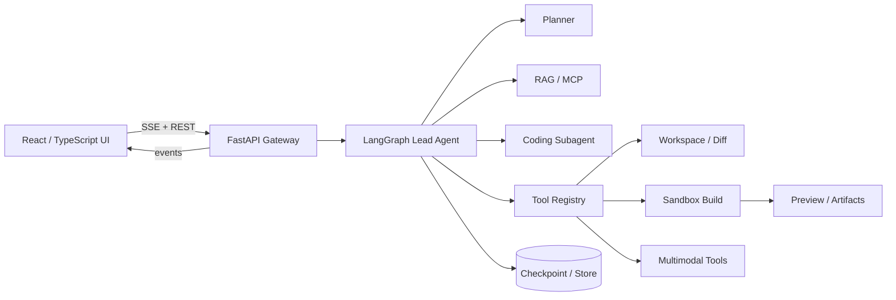

# 前端工程师 Agent 开发 12 周学习计划

> 学习周期：12 周（84 天）  
> 学习投入：每天约 2 小时，总计约 168 小时  
> 主线技术：Python、LangChain、LangGraph、DeerFlow、React/TypeScript  
> 最终作品：一个可观察、可干预、可恢复、支持 RAG/MCP/沙箱与流式 UI 的 AI Native 应用生成 Agent

---

## 1. 这份计划解决什么问题

三份岗位描述共同要求的不只是“会调用大模型”，而是能把 Agent 做成可靠产品：

1. **Agent 基础能力**：Prompt Engineering、结构化输出、Tool Calling、Agent Loop、上下文管理。
2. **工作流编排**：任务规划、状态机、条件分支、重试、自修复、持久化、Human-in-the-loop、多 Agent。
3. **知识与协议**：RAG、MCP、Agent Skills、A2A、多模型路由。
4. **工程能力**：Python 服务端、SSE/WebSocket、异步任务、日志、评测、性能、成本和稳定性。
5. **前端 Agent 体验**：React/TypeScript、复杂状态、流式 UI、工具调用卡片、代码 Diff、文件树、预览、错误恢复。
6. **开发者工具能力**：Monaco、AST/LSP 基础、终端日志、沙箱、构建与部署。
7. **多模态创作**：文本、图片等工具的统一接入和编排。

你的前端背景已经覆盖 React、TypeScript、交互和状态管理，因此本计划不会重复普通前端基础，而是把重点放在：

- 用 Python 建立 Agent 后端能力；
- 从 LangChain 原语过渡到 LangGraph 可控工作流；
- 以 DeerFlow 作为生产级源码范本；
- 把 Agent 的内部执行状态映射成用户可理解的前端体验；
- 最终形成能用于求职展示的完整项目与技术说明。

---

## 2. 框架选择与学习顺序

这三层是递进关系，不是互斥选项：

| 层级 | 本计划中的用途 | 何时使用 |
|---|---|---|
| LangChain | 模型、消息、Prompt、结构化输出、工具、RAG、基础 Agent | 单一目标、标准工具循环 |
| LangGraph | 状态、节点、边、分支、循环、持久化、流式、人工介入 | 需要精确控制复杂工作流 |
| DeerFlow | Lead Agent、Subagent、Middleware、Skills、MCP、Sandbox、前后端流式产品 | 学习完整 SuperAgent 产品架构 |

路线遵循：**先理解原语 → 手写最小循环 → 使用框架 → 拆解生产项目 → 独立重建核心能力**。不要一开始直接复制 DeerFlow，否则容易“会运行，不理解”。

---

## 3. 每天固定的 2 小时学习模板

普通学习日：

- 10 分钟：不看笔记回答前一次课的 3 个问题。
- 25 分钟：阅读官方文档或源码，只记录关键概念。
- 65 分钟：编码、调试和测试。
- 15 分钟：费曼复述，假设向一名初级前端解释今天的知识。
- 5 分钟：制作 3～5 张记忆卡片，并记录明日第一个动作。

复习/大作业日：

- 20 分钟：闭卷回忆与错题修正。
- 80 分钟：阶段项目。
- 20 分钟：演示、复盘、README 或架构图。

如果某天只能学 1 小时：优先完成“闭卷回忆 + 最小可运行代码 + 作业提交”，阅读可顺延，不连续补两天的新内容。

---

## 4. 费曼学习与间隔重复规则

### 4.1 每个知识点的复习节奏

每个重要知识点在以下时间复习：

- D0：当天完成编码和费曼解释；
- D1：第二天闭卷回答；
- D3：三天后改一个变量或场景重新实现；
- D7：一周后在周作业中应用；
- D14：两周后混合题复习；
- D30：一个月后从空目录重建最小版本。

### 4.2 每天的费曼卡片格式

```markdown
## 概念：
- 一句话解释：
- 它解决的问题：
- 输入、输出与状态：
- 最小例子：
- 它最容易失败的地方：
- 与前端概念的类比：
- 我仍不确定的问题：
```

### 4.3 作业完成标准

每天作业至少留下一个可检查产物：代码提交、测试、截图、录屏、架构图、费曼笔记或评测结果。仅“看完文档”不算完成。

### 4.4 每日学习评分与反馈

每天任务结束后必须进行一次基于证据的评分，总分 100 分。评分不是评价聪明程度，而是判断当天内容是否已经达到“能回忆、能使用、能迁移”的程度。

| 维度 | 分值 | 评分证据 |
|---|---:|---|
| 任务完成度 | 25 | 当日产物、必做项、运行结果是否齐全 |
| 概念正确性 | 25 | 解释是否准确，是否混淆相近概念 |
| 动手实现 | 25 | 能否运行、修改、调试代码，而非只阅读或复制 |
| 闭卷检索 | 15 | 不看资料回答问题，纠错后能否重新准确表达 |
| 复盘与迁移 | 10 | 能否说明失败原因、类比、应用场景和下一步 |

评分等级及后续动作：

- **90～100：掌握**。按原计划进入下一天，并在 D3/D7 正常复习。
- **80～89：基本掌握**。可以前进，但下一课开始前增加一道薄弱项检索题。
- **70～79：部分掌握**。下一课前完成 15～30 分钟针对性补练。
- **低于 70：未形成闭环**。暂停新增内容，先重做核心实验与闭卷解释。

每日评分必须保存到 `assessments/WxDy.md`，包含：

1. 五项分数与总分；
2. 支持评分的具体证据；
3. 做得好的地方；
4. 需要加强的 1～3 点；
5. 下一次学习开始前的补强动作；
6. 当前结论是“掌握、基本掌握、部分掌握或未形成闭环”。

纠错后的答案可以证明已经学会，但首次误解仍用于定位薄弱点；不得仅凭“看完了”或模型代写的代码给满分。每周复习日汇总当周每日分数，观察薄弱维度的趋势，不以平均分代替具体问题分析。

---

## 5. 开发环境与目录建议

推荐使用 Python 3.12、`uv`、Node.js LTS、pnpm、Docker、Git。模型供应商可替换，密钥只放在 `.env`，不要提交到 Git。

```text
agent-learning/
├── notes/             # 费曼笔记和记忆卡
├── labs/              # 每日最小实验
├── evaluations/       # 数据集与评测结果
├── agent-backend/     # Python / FastAPI / LangGraph
├── agent-frontend/    # React / TypeScript
└── capstone/          # 最终综合项目
```

每周至少保留一个可运行 tag，例如 `week-01-done`。建议每天一个小提交，提交信息说明“学会了什么”，而不只说明“改了什么”。

---

# 第 1 周：LLM 应用与 Python Agent 基础

**周目标**：补齐前端工程师做 Python AI 后端所需的最小知识，理解 LLM 请求、消息、Token、结构化输出和 Prompt。  
**周产物**：命令行“需求澄清助手”。  
**岗位映射**：Prompt Engineering、Python、LLM 应用范式、AI Coding。

## Day 1：基线测评与环境

- **目标**：明确起点，建立可重复运行的 Python/Node 双端环境。
- **操作**：创建学习仓库与目录；安装 Python、uv、Node、pnpm；配置 `.env.example`；分别运行一次 Python 和 TypeScript 的模型调用；记录耗时与 Token。
- **作业**：写 `baseline.md`，闭卷解释 temperature、上下文窗口、输入/输出 Token；列出 12 周后希望能独立完成的 5 件事。

## Day 2：Python 类型、异步与数据模型

- **目标**：掌握 Agent 后端高频 Python 语法。
- **操作**：练习类型注解、dataclass/Pydantic、异常、生成器、`async/await`；把一个 TypeScript interface 改写为 Pydantic model。
- **作业**：实现异步批量调用模拟器，限制并发数并处理超时；用 200 字解释 Python async 与 Promise 的异同。

## Day 3：消息、Token 与上下文

- **目标**：理解 system/user/assistant/tool 消息及上下文成本。
- **操作**：打印完整请求和响应；比较同一任务在不同 system prompt 下的结果；实现简单消息历史裁剪。
- **作业**：设计 5 个实验说明“Prompt 不是魔法字符串，而是程序输入”；D1 复习 Day 2。

## Day 4：Prompt Engineering

- **目标**：用角色、约束、示例和验收标准构建可测试 Prompt。
- **操作**：为“把自然语言需求转为前端任务”写 zero-shot、few-shot 两版 Prompt；建立 10 条测试输入。
- **作业**：比较两版的正确率、稳定性和 Token；写费曼笔记《好 Prompt 为什么像接口契约》。

## Day 5：结构化输出

- **目标**：获得稳定、可验证的 JSON 输出。
- **操作**：定义 `Requirement`, `Task`, `AcceptanceCriterion` 数据模型；实现解析、校验、失败重试和错误展示。
- **作业**：加入 3 个故意破坏格式的测试；D3 复习 Day 2，并从空文件重写一个 Pydantic 模型。

## Day 6：最小 CLI 应用

- **目标**：把模型调用封装成一个可用程序。
- **操作**：开发需求澄清 CLI：读取需求、输出问题、收集答案、生成结构化任务；加入日志、配置和错误处理。
- **作业**：让另一人或用 3 组陌生需求试用；记录至少 3 个失败案例。

## Day 7：周复习与大作业 1

- **目标**：闭环本周知识并建立第一份作品。
- **操作**：闭卷画出“用户输入→Prompt→模型→解析→校验→输出”；完成 CLI README、安装命令、示例和测试。
- **大作业**：提交“需求澄清助手 v0.1”。验收：结构化输出成功率 ≥ 90%，无密钥泄漏，异常有可理解提示。
- **复习**：重做 Day 3 的上下文裁剪；随机抽取 10 张卡片，正确率低于 80% 的下周重测。

---

# 第 2 周：Tool Calling 与基础 Agent Loop

**周目标**：理解模型如何选择工具、工具如何安全执行，以及 Agent 循环如何停止。  
**周产物**：带 4 个工具、日志与预算限制的“前端项目分析 Agent”。  
**岗位映射**：Function Calling、Tool Calling、Agent Loop、文件树、搜索、构建。

## Day 8：工具的本质

- **目标**：理解工具 schema、描述、参数与返回值。
- **操作**：实现 `read_file`、`list_files` 两个只读工具；观察不同工具描述对选择结果的影响。
- **作业**：为工具写输入校验、错误类型和 6 个单测；D1 回忆周一知识。

## Day 9：手写 Agent Loop

- **目标**：不依赖框架理解模型—工具—模型循环。
- **操作**：手写循环：请求模型、检测 tool call、执行、追加 tool message、继续；加入最大轮数。
- **作业**：画时序图；解释为什么“调用工具”和“执行工具”必须分离。

## Day 10：写操作与安全边界

- **目标**：设计可控的写文件工具。
- **操作**：实现工作区路径校验、dry-run、覆盖确认、文件大小限制；模拟路径穿越攻击。
- **作业**：写 8 个安全测试；D3 复习 Day 8，闭卷重写工具 schema。

## Day 11：搜索、构建与错误返回

- **目标**：让工具错误成为 Agent 可利用的信息。
- **操作**：增加 `search_code`、`run_tests`；统一成功/失败返回结构；让 Agent 根据失败信息修正一次。
- **作业**：构造命令不存在、测试失败、超时三类故障，保存执行轨迹。

## Day 12：LangChain `create_agent`

- **目标**：把手写循环迁移到标准 Agent，并理解框架代劳了什么。
- **操作**：使用 LangChain 创建同等工具 Agent；对比消息序列、停止条件、异常和代码量。
- **作业**：写表格比较手写 Loop 与 LangChain Agent；不能只写“更方便”。

## Day 13：可观察工具轨迹

- **目标**：使执行过程对开发者和用户可解释。
- **操作**：记录 run_id、轮次、工具名、参数摘要、耗时、状态和错误；输出 JSONL trace。
- **作业**：实现隐私脱敏；用一条 trace 复盘 Agent 的一次错误决定。

## Day 14：周复习与大作业 2

- **目标**：完成可控的代码库分析 Agent。
- **大作业**：输入一个 React 项目目录和问题，Agent 可浏览文件、搜索符号、运行测试并输出带证据的结论。
- **验收**：工具参数均校验；最大步数和超时生效；写操作默认关闭；每次运行有完整 trace。
- **复习**：从空文件写最小 Agent Loop；复习第 1 周 Prompt 与结构化输出。

---

# 第 3 周：RAG 与可验证回答

**周目标**：掌握文档加载、切分、Embedding、检索、重排、引用和评测。  
**周产物**：带引用、拒答和评测集的“前端团队知识助手”。  
**岗位映射**：RAG、Search、上下文工程、可靠性。

## Day 15：RAG 全链路

- **目标**：理解索引阶段与查询阶段。
- **操作**：用 Markdown 文档建立最小检索；打印 chunk、向量检索结果和最终上下文。
- **作业**：费曼解释 Embedding、向量相似度和关键词搜索的差异。

## Day 16：切分策略

- **目标**：理解 chunk 大小、重叠与语义边界的取舍。
- **操作**：比较固定长度、Markdown 标题和代码感知切分；对 10 个问题检查召回。
- **作业**：制作切分实验表，给出适合技术文档的选择及证据；D1 复习。

## Day 17：混合检索与元数据

- **目标**：提高专有名词、文件名和版本信息的召回。
- **操作**：实现向量 + 关键词混合检索；加入路径、标题、版本等过滤字段。
- **作业**：为 5 个“向量检索容易失败”的问题做对照实验。

## Day 18：引用、拒答与上下文污染

- **目标**：让回答可验证并在证据不足时拒答。
- **操作**：输出答案、引用片段、来源路径和置信提示；注入冲突文档测试。
- **作业**：设计 5 条无答案问题，统计错误编造率；D3 复习 Day 15。

## Day 19：Agentic RAG

- **目标**：让 Agent 决定是否检索、改写问题和再次检索。
- **操作**：构建“判断是否检索→查询→评估文档→改写→回答”的流程草图和原型。
- **作业**：解释普通 RAG 与 Agentic RAG 的适用边界。

## Day 20：RAG 评测

- **目标**：把“感觉回答不错”变成可量化结果。
- **操作**：制作 20 条问答集；分别计算检索命中、引用正确、答案正确、拒答正确。
- **作业**：定位最差的 5 条并提出改进，不允许先改 Prompt 掩盖检索问题。

## Day 21：周复习与大作业 3

- **目标**：综合应用检索、引用、拒答和评测，形成可重复验证的 RAG 产品。
- **大作业**：完成团队知识助手，索引项目 README、规范和组件文档，支持引用与拒答。
- **验收**：20 条评测集可重复运行；关键指标有基线；回答可追溯到源文件；错误案例有分类。
- **复习**：混合测试 Tool Calling + RAG；解释“检索器为什么也是工具”。

---

# 第 4 周：LangGraph 状态与工作流

**周目标**：掌握显式状态、节点、边、条件路由、循环、并行与子图。  
**周产物**：需求规划—生成—检查—修复工作流。  
**岗位映射**：Workflow、任务调度、复杂状态、自修复。

## Day 22：StateGraph 心智模型

- **目标**：把 Agent 从“聊天函数”理解为状态转换系统。
- **操作**：定义 Typed State；实现 START→分析→输出→END；打印每步状态更新。
- **作业**：用 React reducer 类比 LangGraph state，并指出类比失效之处。

## Day 23：条件边与路由

- **目标**：根据结构化决策选择路径。
- **操作**：实现简单问题直答、复杂问题进入规划、非法输入拒绝三条分支。
- **作业**：覆盖每条边的测试；D1 闭卷画图。

## Day 24：循环与终止

- **目标**：实现有限、自解释的修复循环。
- **操作**：生成代码→运行检查→失败反馈→重试；加入重试次数和相同错误检测。
- **作业**：构造无法修复的失败，证明图能安全终止。

## Day 25：并行与汇聚

- **目标**：理解 fan-out/fan-in 和状态合并。
- **操作**：并行执行需求分析、风险分析、测试建议，再汇总；比较串行耗时。
- **作业**：解释并发冲突、结果顺序和 reducer；D3 复习 Day 22。

## Day 26：子图与职责边界

- **目标**：拆分可测试、可复用工作流。
- **操作**：把代码检查流程封装为子图；规定父图与子图的输入输出。
- **作业**：写 ADR：为何使用子图，而不是一个超长 Prompt。

## Day 27：流式状态更新

- **目标**：区分 token、message、state update 和 custom progress。
- **操作**：分别流式输出模型文本、节点状态、进度事件；观察消费者如何重建状态。
- **作业**：定义前端事件联合类型及乱序/重复处理策略。

## Day 28：周复习与大作业 4

- **目标**：把状态、分支、循环和流式更新组合成一条可测试的代码生成工作流。
- **大作业**：输入一段前端需求，图完成拆解、生成、lint/test、最多两次修复并输出结果。
- **验收**：有架构图；节点可独立测试；所有循环有终止条件；状态字段有明确所有者。
- **复习**：从空目录重建第 2 周工具 Agent 的最小版（D14 间隔复习）。

---

# 第 5 周：持久化、记忆、人工介入与恢复

**周目标**：建立长任务可恢复、关键操作可审批、对话可分支的能力。  
**周产物**：支持暂停/恢复/回滚的变更 Agent。  
**岗位映射**：任务状态、版本回滚、Human-in-the-loop、可靠性。

## Day 29：线程与 Checkpoint

- **目标**：区分会话、运行、状态快照和长期记忆。
- **操作**：为图加入 checkpointer；使用不同 thread_id；关闭进程后恢复。
- **作业**：画 thread/run/checkpoint/message 的关系图。

## Day 30：短期与长期记忆

- **目标**：避免把全部聊天记录误当记忆。
- **操作**：实现会话摘要和用户偏好存储；验证跨线程读取边界。
- **作业**：列出该存、不该存和必须征得同意的信息；D1 复习。

## Day 31：人工审批

- **目标**：在高风险工具前暂停并接受批准、拒绝或编辑。
- **操作**：为写文件、执行命令、部署加入 interrupt；前端先用 CLI 模拟审批。
- **作业**：测试批准、拒绝、修改参数、超时四条路径。

## Day 32：时间旅行与分支

- **目标**：从旧状态派生新分支，而非破坏历史。
- **操作**：查看 checkpoint 历史；从生成前状态改变需求后重跑。
- **作业**：解释 Agent 时间旅行与 Git commit/branch 的相似和差异；D3 复习 Day 29。

## Day 33：幂等、重试和去重

- **目标**：防止恢复后重复执行副作用。
- **操作**：给工具调用设置 idempotency key；模拟断线重连和重复事件。
- **作业**：为“重复写文件/重复部署”写故障测试。

## Day 34：故障模型

- **目标**：系统化处理模型、工具、网络、状态和用户取消。
- **操作**：建立错误分类；定义哪些自动重试、哪些降级、哪些需要用户介入。
- **作业**：制作错误决策表和 5 条故障演练记录。

## Day 35：周复习与大作业 5

- **目标**：验证 Agent 在审批、崩溃恢复和历史分支下仍能保持状态正确。
- **大作业**：变更 Agent 在写文件前等待审批，崩溃后可恢复，从旧 checkpoint 创建另一方案。
- **验收**：副作用不重复；分支历史可追踪；拒绝后状态正确；恢复流程有自动化测试。
- **复习**：D14 复习 RAG，闭卷搭建“检索→证据评估→回答”流程图。

---

# 第 6 周：SSE、React 流式 UI 与复杂前端状态

**周目标**：把 Agent 内部状态变成稳定、可理解、可干预的 React 体验。  
**周产物**：Agent 执行控制台。  
**岗位映射**：Streaming、SSE/Event Stream、复杂状态、任务/消息/工具/沙箱同步。

## Day 36：SSE 协议

- **目标**：理解流式传输、事件 ID、重连和完成信号。
- **操作**：FastAPI 输出 token/progress/tool/error/end 事件；用 curl 和浏览器消费。
- **作业**：比较 SSE、WebSocket、轮询在 Agent 场景的取舍。

## Day 37：前端事件归约器

- **目标**：由事件流确定性重建 UI 状态。
- **操作**：定义 discriminated union；实现 reducer 管理 run、message、tool call、error。
- **作业**：测试重复、乱序、断线和未知事件；D1 复习。

## Day 38：流式消息与工具卡片

- **目标**：分别表达“模型正在说”和“工具正在做”。
- **操作**：实现增量 Markdown、工具参数摘要、运行中/成功/失败状态和耗时。
- **作业**：用录屏解释一次完整 Agent Run，而不是只展示最终答案。

## Day 39：断线重连与 Join Stream

- **目标**：刷新页面后仍能回到正在运行的任务。
- **操作**：持久化 run_id、last_event_id；重连后补齐事件并去重。
- **作业**：自动化测试刷新、弱网、重复连接；D3 复习 Day 36。

## Day 40：人工介入 UI

- **目标**：实现 approve/reject/edit 的清晰交互。
- **操作**：展示风险、工具参数、影响范围；审批后恢复流；拒绝时保留上下文。
- **作业**：写一页交互准则：什么操作必须打断用户，什么操作只需通知。

## Day 41：多状态一致性

- **目标**：管理任务、文件、消息、工具、checkpoint 多条时间线。
- **操作**：规范服务端为事实来源；实现快照 + 增量事件；处理乐观更新回滚。
- **作业**：画状态所有权图，找出至少 3 个潜在竞态。

## Day 42：周复习与大作业 6

- **目标**：交付一个可重连、可审批、可解释执行过程的 React Agent 控制台。
- **大作业**：完成 React Agent 控制台：流式消息、节点进度、工具卡片、审批、重连、错误恢复。
- **验收**：刷新不丢运行；事件可重放；错误不导致白屏；键盘可操作；状态 reducer 有测试。
- **复习**：D14 复习 LangGraph，从空白画出含循环、条件和人工介入的图。

---

# 第 7 周：DeerFlow 源码导读与运行时

**周目标**：能运行、追踪并解释 DeerFlow 的请求路径，不停留在界面试用。  
**周产物**：DeerFlow 架构导读文档和一次小改动。  
**岗位映射**：LangGraph、Agent Runtime、Sandbox、Skills、MCP、开源项目经验。

> 以当前检出的 DeerFlow 版本为准。先读仓库 README、安装文档和各目录的 `AGENTS.md`，不要套用旧版文章中的架构。

## Day 43：运行 DeerFlow

- **目标**：建立端到端可运行基线。
- **操作**：阅读安装与配置；启动前后端；完成一次普通问答、一次工具调用；记录端口和进程。
- **作业**：写安装踩坑清单和一键复现步骤。

## Day 44：仓库地图

- **目标**：识别 frontend、gateway/runtime、agent、sandbox、skills、MCP 的边界。
- **操作**：用目录树和入口文件画 C4 Container 图；标出配置加载路径。
- **作业**：5 分钟口述“一个请求经过哪些组件”；D1 复习。

## Day 45：Lead Agent 与 Middleware

- **目标**：理解 Agent 创建、工具装配和中间件链。
- **操作**：从 lead agent 入口追踪到模型、工具、中间件；为每个中间件记录输入、输出和副作用。
- **作业**：选择一个中间件画执行时序，并说明为何不是普通工具。

## Day 46：线程、运行与 SSE

- **目标**：追踪浏览器到后端再回到 UI 的完整事件流。
- **操作**：用 DevTools 检查创建 thread、run、stream；在后端打断点/日志关联 ID。
- **作业**：保存一份脱敏网络事件样本；D3 复习 Day 43。

## Day 47：工具与 Sandbox

- **目标**：理解安全执行和工作目录隔离。
- **操作**：追踪一次 bash/file 工具调用；记录命令如何进入 sandbox、如何返回日志和 artifact。
- **作业**：列出 10 条沙箱威胁及现有/建议防护。

## Day 48：Skills、MCP 与 Subagent

- **目标**：理解能力扩展与任务委派。
- **操作**：阅读 Skills 加载、MCP 配置、task/subagent 执行路径；画 Lead Agent 委派图。
- **作业**：解释 Skill、Tool、MCP Server、Subagent 各自解决什么问题。

## Day 49：周复习与大作业 7

- **目标**：能够从端到端运行轨迹解释 DeerFlow 的核心架构，并完成一次受控扩展。
- **大作业**：提交《DeerFlow 源码导读》：架构图、请求时序、状态模型、扩展点、风险和 5 个关键源码链接；完成一个低风险小改动（如新增只读工具或进度 UI）。
- **验收**：能从 UI 事件定位到后端产生位置；改动有测试或手工验证；文档不依赖旧版架构印象。
- **复习**：D30 复习第 3 周 RAG，从空目录重建最小检索 Demo。

---

# 第 8 周：MCP、Skills、多 Agent 与多模型路由

**周目标**：构建标准化工具接入、技能按需加载、角色委派与模型选择。  
**周产物**：可扩展的研究/编码双 Agent。  
**岗位映射**：MCP、Agent Skills、A2A、多 Agent、Agent 市场、多模型路由。

## Day 50：MCP 心智模型

- **目标**：理解 client/server、tools/resources/prompts 和 transport。
- **操作**：阅读协议核心概念；画宿主、客户端、服务端关系；连接一个本地只读 MCP Server。
- **作业**：解释 MCP 与普通 REST API、LangChain Tool 的差异。

## Day 51：自建 MCP Server

- **目标**：把团队能力封装成标准工具。
- **操作**：实现组件文档搜索和项目统计两个工具；加入 schema、错误和日志。
- **作业**：写契约测试和 README；D1 复习。

## Day 52：权限与注入风险

- **目标**：防止远程工具扩大 Agent 权限。
- **操作**：实现 allowlist、参数验证、超时、结果大小限制；测试恶意工具描述和不可信内容。
- **作业**：完成 MCP 威胁模型与审批矩阵。

## Day 53：Agent Skills

- **目标**：理解按需加载领域说明与固定工作流。
- **操作**：编写“React 性能审查”Skill，包含触发条件、步骤、产物和验收标准。
- **作业**：比较把知识放 system prompt、RAG、Skill 的取舍；D3 复习 Day 50。

## Day 54：Subagent 委派

- **目标**：让主 Agent 负责规划，专业 Agent 负责受限任务。
- **操作**：构建 researcher 和 coder；定义输入、输出、预算、超时和上下文隔离。
- **作业**：测试委派失败、部分结果和上下文泄漏。

## Day 55：多模型路由

- **目标**：按任务、成本、延迟和能力选择模型。
- **操作**：定义 fast/strong/vision 三种能力标签；实现规则路由和 fallback；记录成本。
- **作业**：用 15 个任务评估路由准确性，并分析错误路由。

## Day 56：周复习与大作业 8

- **目标**：综合验证 MCP、Skill、Subagent 与多模型路由的边界和协作方式。
- **大作业**：Lead Agent 通过 MCP 获取资料，把研究委派给 researcher，把修改建议交给 coder，并按任务路由模型。
- **验收**：协议边界明确；子 Agent 有独立预算；敏感工具需审批；trace 能显示委派链。
- **复习**：D14 复习持久化与幂等；口述一次断点恢复流程。

---

# 第 9 周：AI Coding、Monaco、Diff 与沙箱预览

**周目标**：构建岗位描述中的 prompt→plan→edit→diff→build→preview→fix 体验。  
**周产物**：最小 AI App Builder。  
**岗位映射**：代码编辑、Diff、terminal log、build error、preview、WebContainer/E2B、编辑器。

## Day 57：文件树与工作区模型

- **目标**：定义 Agent 和前端共享的文件状态。
- **操作**：实现文件列表、读取、创建、更新、删除的受控 API；加入版本号和冲突检测。
- **作业**：测试并发编辑与越权路径。

## Day 58：Monaco 与编辑状态

- **目标**：区分服务端文件、编辑器 buffer 和未保存改动。
- **操作**：接入 Monaco；实现选中文件、dirty 状态、保存和外部修改提示。
- **作业**：画三层状态同步图；D1 复习。

## Day 59：Patch 与 Diff

- **目标**：让 Agent 提交最小、可审查的修改。
- **操作**：生成 unified diff；前端展示前后对比；用户可接受/拒绝单个文件。
- **作业**：测试 patch 冲突、部分应用、二进制文件和大文件。

## Day 60：构建日志与错误定位

- **目标**：把终端输出映射到文件和错误。
- **操作**：流式展示 install/build/test；解析常见 TypeScript/Vite 错误；点击跳转行号。
- **作业**：收集 5 类真实构建错误作为回归集；D3 复习 Day 57。

## Day 61：Sandbox Preview

- **目标**：在隔离环境构建并预览生成应用。
- **操作**：选 Docker、WebContainer 或远程 sandbox 实现一种；限制 CPU、内存、时间和网络；返回预览 URL。
- **作业**：解释选型依据和安全边界。

## Day 62：错误自修复闭环

- **目标**：让构建错误驱动有限修复。
- **操作**：把精简错误、相关文件和最近 diff 反馈给 Agent；最多修复两轮；相同错误停止。
- **作业**：对回归集统计首次成功率、修复成功率、平均轮次和成本。

## Day 63：周复习与大作业 9

- **目标**：打通从自然语言需求到可审查代码、沙箱构建与预览的完整链路。
- **大作业**：用户输入小应用需求，系统规划、生成文件、展示 Diff、沙箱构建、实时预览并尝试修复错误。
- **验收**：用户可中止；修改可审查；构建日志可定位；失败不会无限循环；工作区不可越界。
- **复习**：D30 复习第 4 周 LangGraph，闭卷重写条件循环图。

---

# 第 10 周：多模态、任务队列与产品质量

**周目标**：接入图片工具，处理长任务调度，建立可用性和无障碍质量标准。  
**周产物**：多模态创作工作流。  
**岗位映射**：图像/视频/文案统一接入、多模态、任务调度、生成体验质量。

## Day 64：多模态消息模型

- **目标**：统一文本、图片、文件和 artifact 的表示。
- **操作**：设计内容块 schema；支持上传、预览、模型输入和结果引用。
- **作业**：测试缺失文件、超大图片、错误 MIME 和重复上传。

## Day 65：图片工具编排

- **目标**：把图片生成/理解作为工具，而非硬编码流程。
- **操作**：定义生成图片、分析图片工具；支持进度、失败和 artifact 元数据。
- **作业**：设计 10 个提示评测视觉一致性；D1 复习。

## Day 66：创作 Workflow

- **目标**：把文案、配图和页面生成组合成可恢复任务。
- **操作**：规划→并行生成文案/图片→页面组装→检查；失败只重跑对应节点。
- **作业**：解释为什么局部重跑依赖明确的状态边界。

## Day 67：任务队列与取消

- **目标**：处理排队、运行、取消、重试和优先级。
- **操作**：实现最小后台任务模型；取消信号传入 Agent 与工具；前端显示队列。
- **作业**：测试取消与工具完成同时发生的竞态；D3 复习 Day 64。

## Day 68：生成产品质量

- **目标**：建立视觉、响应式、交互和一致性检查。
- **操作**：定义检查表；运行移动/桌面视口；验证 loading/error/empty 状态。
- **作业**：对两个生成页面盲评，列证据而非个人喜好。

## Day 69：无障碍与信任体验

- **目标**：让非技术用户也能理解 Agent 正在做什么。
- **操作**：检查键盘、焦点、ARIA、颜色对比；把内部日志翻译为用户进度；高级日志折叠展示。
- **作业**：写《Agent UI 的 10 条信任原则》。

## Day 70：周复习与大作业 10

- **目标**：完成支持局部失败恢复、取消和产物管理的多模态创作流程。
- **大作业**：输入活动主题，Agent 生成文案、配图和响应式落地页；支持局部重试、取消和 artifact 下载。
- **验收**：多模态状态统一；失败可局部恢复；移动端可用；关键操作有用户反馈。
- **复习**：D14 复习 DeerFlow 请求链，闭卷画架构和流式时序。

---

# 第 11 周：评测、可观察性、性能、成本与安全

**周目标**：让系统从“Demo 可用”走向“工程上可信”。  
**周产物**：评测流水线、Trace 面板和性能报告。  
**岗位映射**：高并发、推理效率、稳定性、成本、系统可用性、CI/CD。

## Day 71：评测体系

- **目标**：区分确定性测试、轨迹评测、结果评测和人工评测。
- **操作**：建立 30 条综合数据集；定义任务成功、工具正确、引用正确、构建成功等指标。
- **作业**：为每个指标写通过条件和反作弊说明。

## Day 72：轨迹与可观察性

- **目标**：从一次请求定位到模型、节点、工具和错误。
- **操作**：统一 trace_id/run_id/tool_call_id；记录耗时、Token、成本、重试和状态转移。
- **作业**：仅凭 trace 复盘一个失败；D1 复习。

## Day 73：延迟优化

- **目标**：分析首 Token、总时长和关键路径。
- **操作**：测量模型、检索、工具、构建各阶段；并行无依赖任务；缓存稳定结果。
- **作业**：提交前后对比，至少优化一个 P95 指标。

## Day 74：成本与上下文工程

- **目标**：用摘要、检索和文件按需加载控制成本。
- **操作**：记录每任务成本；比较全量上下文与按需上下文；设置预算终止。
- **作业**：在质量下降不明显的前提下降低一次基准任务成本；D3 复习 Day 71。

## Day 75：安全

- **目标**：覆盖 Prompt Injection、数据泄露、危险命令、依赖风险和 SSRF。
- **操作**：建立红队输入；隔离不可信内容；敏感工具审批；密钥脱敏；网络 allowlist。
- **作业**：完成 15 条攻击测试及结果。

## Day 76：并发、限流与降级

- **目标**：在资源有限时保持可用。
- **操作**：加入用户/模型限流、队列上限、超时、熔断和 fallback；模拟并发请求。
- **作业**：写负载结果和降级策略，不以平均延迟替代 P95/P99。

## Day 77：周复习与大作业 11

- **目标**：用评测、追踪、性能与安全证据证明系统具备工程可信度。
- **大作业**：为前 10 周系统建立 CI 评测：单测、Agent 数据集、攻击测试和性能冒烟；生成报告。
- **验收**：每次变更可比较基线；失败能定位；有预算和并发保护；日志无敏感信息。
- **复习**：D30 复习第 6 周流式 UI，从事件样本重建 reducer。

---

# 第 12 周：综合项目、作品集与面试表达

**周目标**：交付一个与招聘要求直接对齐的作品，而不是教程拼接。  
**最终项目**：AI Native App Builder。  
**功能链路**：prompt → clarify → plan → tool call → code edit → diff approval → sandbox build → preview → error fix → checkpoint/version → deploy（部署可使用模拟器，真实发布必须手动批准）。

## Day 78：范围冻结与 ADR

- **目标**：限定 MVP，防止最后一周失控。
- **操作**：写用户故事、非目标、架构图、状态模型、事件协议和风险；拆成 6 个垂直切片。
- **作业**：3 分钟讲清“用户问题、方案、为何用 LangGraph/DeerFlow 思想”。

## Day 79：主链路打通

- **目标**：端到端完成最薄的一条成功路径。
- **操作**：输入需求→生成一个文件→展示 Diff→构建→预览；暂不追求复杂 UI。
- **作业**：保存演示录屏和 trace；D1 复习。

## Day 80：规划、工具与 RAG

- **目标**：加入需求澄清、任务计划和组件知识检索。
- **操作**：实现 planner；接入团队组件 RAG/MCP；显示证据和任务进度。
- **作业**：用 5 个需求检查规划质量和检索正确性。

## Day 81：审批、恢复与版本

- **目标**：实现可信的关键控制点。
- **操作**：Diff 审批；checkpoint 恢复；方案分支；失败后继续；记录版本。
- **作业**：完成崩溃恢复和拒绝修改演练；D3 复习 Day 78。

## Day 82：自修复、评测与安全

- **目标**：完成失败闭环并验证边界。
- **操作**：构建错误修复；运行综合评测和攻击集；修复最高风险问题。
- **作业**：生成质量报告，诚实列出仍失败的案例。

## Day 83：作品集包装

- **目标**：让面试官 5 分钟内看懂价值与深度。
- **操作**：完善 README、架构图、GIF/视频、快速启动、技术决策、指标、已知限制；清理密钥和临时代码。
- **作业**：写 5 个 STAR 故事：流式状态、恢复、沙箱安全、RAG 评测、性能优化。

## Day 84：最终答辩与大作业 12

- **目标**：在未知需求变化和故障注入下证明最终系统可用、可控、可信、可恢复。
- **大作业**：完整演示 App Builder，并接受一次临时需求修改和一次故障注入。
- **验收**：
  - 用户能看到计划、工具、进度和错误；
  - 写文件/部署有审批；
  - 流式断线可恢复；
  - 构建失败最多有限次数自修复；
  - RAG 回答有引用；
  - 沙箱与路径有边界；
  - 至少 30 条评测可重复执行；
  - README 能让他人启动；
  - 有性能、成本、安全与已知限制报告。
- **终期复习**：随机抽 30 张卡片；闭卷画完整架构；回答“什么时候只用 LangChain、什么时候用 LangGraph、DeerFlow 给了你哪些生产启发”。

---

## 6. 最终项目建议架构



前端至少包含以下状态域：

- thread / run / checkpoint；
- messages / streaming chunks；
- plan / tasks；
- tool calls / approvals；
- files / editor buffers / diffs；
- sandbox / build logs / preview；
- artifacts / deploy versions；
- errors / retry / cancellation。

---

## 7. 每周自评量表

每周日按 0～2 分打分，总分 16 分；低于 12 分，不要盲目进入下一周，先补最弱项。

| 项目 | 0 分 | 1 分 | 2 分 |
|---|---|---|---|
| 概念 | 不能解释 | 看笔记能解释 | 能用例子和反例闭卷解释 |
| 编码 | 未运行 | 跟做可运行 | 可从空目录重建 |
| 测试 | 无测试 | 只有成功路径 | 有失败、边界和回归 |
| 可观察性 | 看最终答案 | 有日志 | 能由 trace 定位失败 |
| 安全 | 未考虑 | 有零散校验 | 有威胁模型和自动测试 |
| 产品体验 | 仅 Demo | 主流程可用 | 失败、取消、恢复均清晰 |
| 文档 | 无 | 有启动说明 | 有架构、决策、指标和限制 |
| 迁移能力 | 只会原例 | 能改参数 | 能用于新的业务问题 |

---

## 8. 岗位能力覆盖检查表

完成计划后，应能拿作品或代码回答下列问题：

- [ ] Prompt、结构化输出、Tool Calling、Agent Loop 分别解决什么？
- [ ] 如何判断用 LangChain Agent、LangGraph 工作流还是更高层 Agent Harness？
- [ ] 如何设计 RAG 的切分、检索、引用、拒答和评测？
- [ ] 如何实现条件分支、循环、并行、子图、持久化和 Human-in-the-loop？
- [ ] 如何防止断点恢复后重复执行写文件或部署？
- [ ] 如何通过 SSE 把 token、工具、状态和错误映射到 React UI？
- [ ] 如何处理乱序、重复、重连和多状态一致性？
- [ ] MCP、Tool、Skill、Subagent、A2A 的边界是什么？
- [ ] DeerFlow 的请求、运行、Middleware、Sandbox、Skills/MCP 路径是什么？
- [ ] 如何实现文件树、Monaco buffer、Diff、终端日志和预览的一致性？
- [ ] 如何建立 build error → 定位 → patch → rebuild 的有限自修复循环？
- [ ] 如何评测 Agent 的结果、轨迹、延迟、成本和安全？
- [ ] 如何在高并发下进行限流、排队、超时、降级和取消？
- [ ] 如何讲清一个 AI Native 产品为何“可控、可信、可恢复”？

---

## 9. 学习资料选择原则

1. LangChain/LangGraph 以当前官方文档和当前安装版本 API 为准，优先学习 `create_agent`、StateGraph、streaming、persistence、human-in-the-loop 和 RAG。
2. DeerFlow 以当前仓库 README、架构文档、API 文档和实际源码为准；项目演进快，不依赖旧博客记忆架构。
3. MCP 以官方协议文档和 SDK 示例为准，先本地只读工具，再逐步开放副作用。
4. 每阅读一个教程，都要改变输入、加入失败场景、补测试并写自己的解释；复制运行不计入掌握。
5. AI Coding 工具可用于解释报错和代码审查，但每日核心练习至少有一部分必须闭卷完成。

参考入口：

- [LangChain Agents](https://docs.langchain.com/oss/python/langchain/agents)
- [LangGraph Overview](https://docs.langchain.com/oss/python/langgraph/overview)
- [LangGraph Streaming](https://docs.langchain.com/oss/python/langgraph/streaming)
- [LangGraph Agentic RAG](https://docs.langchain.com/oss/python/langgraph/agentic-rag)
- [DeerFlow GitHub](https://github.com/bytedance/deer-flow)
- [Model Context Protocol](https://modelcontextprotocol.io/)

---

## 10. 开始前和结束后的能力对比

### 开始前基线任务

限时 2 小时完成：

> 输入一个前端需求，让模型返回任务列表，并提供一个读取本地文件的工具。

记录：完成度、代码结构、失败处理、测试、Token/成本、你无法解释的部分。

### 第 84 天终测

仍限时 2 小时，从空目录完成：

> 构建一个可调用两个工具、流式显示过程、写操作需审批、失败可重试且有最大步数的 Agent。

比较基线和终测，不只比较代码量，还比较：

- 是否能解释状态和执行路径；
- 是否有清晰的错误与安全边界；
- 是否可测试、可观察、可恢复；
- 是否能把执行过程转化为可信的用户体验。

---

## 11. 第一周立即执行清单

不要等“准备充分”才开始：

- [ ] 创建 `agent-learning` 仓库和建议目录。
- [ ] 完成 Day 1 基线任务并计时。
- [ ] 建立 `notes/cards.md`，写第一批记忆卡。
- [ ] 在日历中固定每天 2 小时。
- [ ] 创建周日演示提醒。
- [ ] 选择一个小型 React 项目作为前 6 周的统一实验材料。
- [ ] 为最终项目建立 `capstone/README.md`，每周只更新理解和决策，暂不提前堆功能。

坚持的判据不是连续打卡，而是每周都有：**可运行代码、失败案例、测试、费曼解释和一个可演示产物**。
